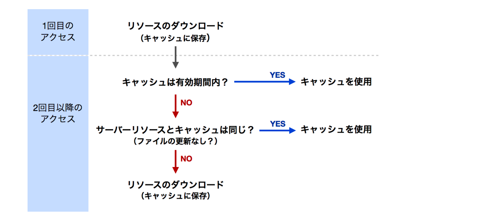

# web-front-end-performance-checklist

---

### パフォーマンス改善に取り組む前に読んで欲しいもの
- [ブラウザの仕組みとwebページが表示されるまでのフロー](https://fuzzy-hunter-3bf.notion.site/Web-c945271a34b54e4c8a6b5c3b0d7ffd30)
- 以下に記載しているチェックリストをすべて網羅すれば良いわけではないと考えます。プロジェクトメンバーのリソースやパフォーマンスのゴール、費用対効果を考慮して最適な対策を施してください

# 1. 測定する
- ツールでの測定
  - [PageSpeed Insights](https://pagespeed.web.dev/?utm_source=psi&utm_medium=redirect&hl=ja)
    - [ ] スコアを測定しボトルネックを特定する
    - [ ] 実施した際の費用（リソース等）と効果のバランスを検討する
  - [Lighthouse](https://chrome.google.com/webstore/detail/lighthouse/blipmdconlkpinefehnmjammfjpmpbjk?hl=ja)
    - [ ] スコアを測定しボトルネックを特定する
    - [ ] 実施した際の費用（リソース等）と効果のバランスを検討する
  - [newrelic（継続的監視）](https://newrelic.com/lp/browser-monitoring)
    - [ ] パフォーマンスを測定しボトルネックを特定する
- Network パネルでの測定（時間がかかっている処理を特定する）
  - [ ] DOMContentLoaded（青い線）
    - ※遅い場合、スクリプトによる読み込みブロックの可能性あり（JavaScript 実行のチューニング参照）
  - [ ] Load イベント（赤い線）
    - ※遅い場合、リソースの容量が大き過ぎる可能性あり
  - ※Network パネルでの各項目についての詳細は[コチラ](https://fuzzy-hunter-3bf.notion.site/Web-c945271a34b54e4c8a6b5c3b0d7ffd30#1a8908946aca4f03a54f1fdc8da5b0fb)
- Performance パネルでの測定
  - []ボトルネックの特定
    - Frame 内でどこに一番時間がかかっているのかを特定する
      1. リソース読み込み（Loading）
      2. JavaScript 実行（Scripting）
      3. レイアウト計算（Rendering）
      4. レンダリング結果の描画（Painting）
- Memory パネルでの測定
  - [ ] メモリを使い過ぎている箇所を特定する

#2. リソース読み込みのチューニング
### 方針
- 読み込むリソースの大きさと数を減らす
- レンダリングをブロックする読み込みを減らす
- ブラウザとサーバ間の遅延を減らす
- ブラウザのキャッシュを利用する
---

- [ ] HTML/CSS/JavaScript を最小化しているか（webpack 使用時は mode: production を使用しているか）
  - ※参考ツール
  - HTML
    - [html-minifier](https://www.npmjs.com/package/html-minifier)
  - CSS
    - [clean-css](https://www.npmjs.com/package/clean-css)
    - [csso](https://www.npmjs.com/package/csso)
  - JavaScript
    - [uglify-js](https://www.npmjs.com/package/uglify-js)
- [ ] 写真
- [ ] 適切な画像形式を選択しているか
  - JPEG：写真や色のグラデーションが複雑なもの
  - PNG：PC で作成したデータや透明を使うもの
  - GIF：色が単純なアニメーション
  - SVG：ベクター形式で作成されたロゴ
  - BMP：写真向きだがファイルサイズ大きすぎて使えない
  - WebP：ブラウザ対応できれば JPG,PNG,GIF の代わりに
  - 参考資料： [非可逆圧縮と可逆圧縮](https://fuzzy-hunter-3bf.notion.site/64cf91c582224f54b36f6d164d90aacb)
- [ ] 画像ファイルを最適化しているか
  - ※参考ツール（これらは[imagemin](https://github.com/imagemin/imagemin) などのラッパーツールから使ったり、タスクランナーやビルドツールから使う
  - JPEG
    - [jpegtran](http://jpegclub.org/jpegtran/)
    - [mozjpeg](https://github.com/mozilla/mozjpeg)
  - PNG
    - [ZopfliPNG](https://github.com/google/zopfli)
    - [pngquant](https://pngquant.org/)
    - [Pngcrush](https://pmt.sourceforge.io/pngcrush/)
  - GIF
    - [GIFsicl](https://www.lcdf.org/gifsicle/)
- [ ] CSS の import を避けているか（import するファイルを直列で取得していくため好ましくない）
  - webpack 等を使い 1 つの CSS へ統合する or Sass 等の CSS メタ言語を使用する
- [ ] JavaScript の同期的な読み込みを避けられているか
  - JavaScript 読み込みはドキュメントのパース・CSS ファイルの読み込みをブロックする = そのウェブページのレンダリングもブロックする
  - [defer属性 or async属性](https://fuzzy-hunter-3bf.notion.site/defer-async-3337fec0601840feb78619d837ff3a1e) を使うことが望ましい
- [ ] デバイスピクセル比ごとに読み込む画像を切り替えているか
  - 例…secret 属性を使いデバイスピクセルが 1 と 2 で画像をだし分ける
  ```html
  
  ```
  - ※HTML5.1 においてはメディアクエリで指定せずとも HTML で完結する[レスポンシブイメージ](https://ics.media/entry/13324/) を使うと良い
- [ ] CSS のメディアクエリを適切に使用する
  - 例…印刷時のみ適用したい CSS をメディアクエリで指定する
  ```scss
  /* 印刷時のみ適用されるCSS */
  @media print { 
   body {
     background-color: white;
     color: black;
    }
  }
  
  /* ビューポートが40em以下の場合のみ適用されるCSS */
  @media (min-width: 40em) { 
  /* … */
   }
  ```
  - 例…link 要素に書くとき（こっちができるならメディアクエリよりこっちの方が効果的）
  ```html
  <!スクリーン表示時のみ適用されるCSS>
  <link href="style.css" rel="stylesheet" media="screen">
  
  <!印刷時のみ適用されるCSS>
  <link href="print.css" rel="stylesheet" media="print">
  
  <!ビューポートの横幅が920px以上の場合に適用されるCSS>
  <link href="other.css" rel="stylesheet" media="(minwidth:920px)">
  ```
  
- [ ] CSS スプライトを使って複数の画像をまとめる（小さな画像ファイルを大量に利用する場合など）
  - 例…[google](https://ssl.gstatic.com/gb/images/p2_772b9c3b.png)のトップページで使用されている（画像の Y 軸を指定してアイコンを出し分けている）
- [ ] link 要素を使ったリソースを事前読み込みしているか
  - [ ] [DNS プリフェッチ](https://www.notion.so/link-e1e93db5b0424c6996f08ec857280dc4#2cf04459131441c38b7d9c8dee3c643a) しているか
  - [ ] [prefetch: リソースの事前読み込み](https://www.notion.so/link-e1e93db5b0424c6996f08ec857280dc4#5762bdae7c594eb2a71440f3c7d12f1f) をしているか
  - [ ] [prerender: ウェブページのプリレンダリング](https://www.notion.so/link-e1e93db5b0424c6996f08ec857280dc4#2fff691772764cc5840a00f3af90e3ee) をしているか
  - [ ] [preconnect: 接続の投機的開始](https://www.notion.so/link-e1e93db5b0424c6996f08ec857280dc4#78b23105ae1e4da1979f3136bf243671) をしているか
- [ ] gzip 圧縮を有効にしているか
  - [参考資料](https://fuzzy-hunter-3bf.notion.site/Gzip-f3e756ce9c9e47dbb47ac9e481143c3c)
- [ ] CDN を用いてリソースを配信しているか
  - [参考資料](https://fuzzy-hunter-3bf.notion.site/CDN-4128038c53814bc4a54928bd1066f0b8)
- [ ] リソースを配信するホストを適切に分割する（ドメインシャーディング）
  - ブラウザのリソース取得における同時接続数の設定がホスト（ドメイン）単位のため、ドメインを分けることで同時接続制限を擬似的にあげる
  - HTTP/2 ではあまり意味がない
    - HTTP/2 では 1 つの接続の中で並列でリクエストとレスポンスを受け取ることができ、ドメインごとの同時接続数の制限がないため
- [ ] 不要なリダイレクトをしていない
  - 余計な DNS の名前解決や TCP3 ハンドシェイクなどの接続の前処理を再び行う必要がある
  - リダイレクトを表す HTTP レスポンス
  - ```html
    HTTP/1.1 302 Found
    Location: http://example.com/
    ```
  - やりがちな実装
    - リンクの URL のパスでディレクトリ名を指定した場合
    - 例…foo/index.html へのリンク
    - ```html
      <a href="http://example.com/foo"></a>
      ```
    - 上記のように書くと foo ディレクトリのインデックスである`http://example.com/foo/` へのリダイレクトを行ってしまう
  - どうすればいいか
    - スラッシュをつける or ファイル名まで指定する
    ```html
    <a href="http://example.com/foo/"></a>
    or
    <a href="http://example.com/foo/index.html"></a>
    ```
- [ ] ブラウザのキャッシュを活用しているか
  - [ ] 画像（HTML, CSS, JavaScript）など静的なファイルに対して CacheControl ヘッダーを付与しているか
  - [ ] 古いキャッシュがそのまま使われないようリソースにトークンが付与されているか
    - 以下の HTTP ヘッダーを設定してブラウザのキャッシュを行う
      - ●Expires ヘッダー（強いキャッシュ）
      - ●CacheControl ヘッダー（強いキャッシュ）
      - ●LastModified ヘッダー（弱いキャッシュ）
      - ●ETag ヘッダー（弱いキャッシュ）
    - 強いキャッシュ（画像・CSS・JavaScript など比較的静的なリソースに適している）
      - Expires ヘッダー（強いキャッシュ）
        - 一度リソースの取得を行うと自動的にブラウザにキャッシュされる
        - キャッシュされたファイルが消えるか、期限が切れるまで残る
        - 以下のようにサーバ側に期限を設定する
        ```html
          Expires:Mon,02Nov201513:19:30GMT
        ```
        - サーバとクライアントの時間設定がズレている場合にキャッシュの期限が意図通りに設定できない
      - CacheControl ヘッダー（強いキャッシュ）
        - サーバ側に max-age パラメータでキャッシュの期限を秒数で指定できる
        ```
        CacheControl:maxage=600 
        ``` 
      - Expires ヘッダーと CacheControl ヘッダーの使い分け
        - 両方設定されている場合は CacheControl ヘッダーを優先する
        - モダンブラウザは全て CacheControl ヘッダーなので CacheControl ヘッダーだけでも良い
      - 更新されるリソースの場合はリソースにタイムスタンプなどを付与して古いリソースがキャッシュから取得されないようにする
       ```html
       
       ```
    - 弱いキャッシュ
      - いつ更新されるかわからないリソースに対してキャッシュを設定したい場合に有効
      - 変更がない場合は 304（Not Modified）ステータスコードを返し、それを判断してキャッシュを使う
        - Last-Modified ヘッダー
        - ETag ヘッダー
      - 条件付き HTTP リクエストを用いることでウェブサーバ側からキャッシュをクリアできる
      - Last-Modified ヘッダー
        - 動作の説明
          - 初めてリソースを取得するときは Last-Modified ヘッダーを送信する
          - ```html
            LastModified:Wed,15Nov199504:58:08GMT
            ```
          - 同じリソースを取得する際
            - `if-Modifed-Since`ヘッダーを入れる（条件付き GET リクエスト）
            - ```html
              IfModifiedSince:Wed,15Nov199504:58:08GMT
              ```
    - 強いキャッシュと弱いキャッシュの使い分け
      - 強いキャッシュ
        - 画像・CSS・JavaScript など比較的静的なリソースで
        - HTML ファイルなどを通じて間接的に取得するリソースの場合はファイル名にトークンなどをつける
      - 弱いキャッシュ
        - 更新が起きやすい HTML ファイルや更新があったことをウェブサーバから通知させたいとき
      - 基本は強いキャッシュでカバーできないかを考えて、難しそうなら弱いキャッシュで賄えないかを考える
        
- [ ] HTTP/2 を使用している場合